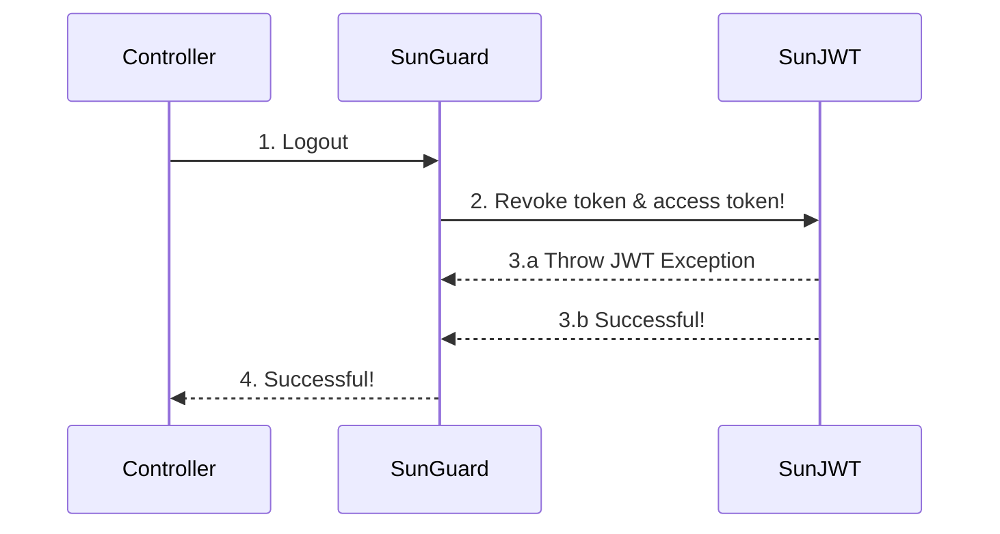

# Tech Standard PHP Auth

[](https://github.com/sun-asterisk/tech-standard-php-auth/actions/workflows/check_ci.yml)[](https://packagist.org/packages/rebing/graphql-laravel)

## 🌟 Introduction

Sun* Auth is a library designed to provide authentication and authorization features for web/mobile applications. It is built using modern technologies and provides a range of features that make it easy to integrate into existing applications.

One of the key reasons for using Sun* Auth is its ease of use. It provides a simple library that makes it easy to add authentication and authorization to any application. Additionally, it is designed to be highly customizable, allowing developers to tailor it to their specific needs.

Using Sun* Auth saves time and effort for developers, as we do not have to independently write and test complex authentication and authorization features. Additionally, Sun* Auth provides a simple and easy-to-understand library that makes it easy to integrate into existing web/mobile applications.

Some of the features provided by Sun* Auth include user registration and login, password reset and recovery.

---

* [🔌 Installation](#-installation)
    * [Laravel](#-laravel)
    * [Lumen](#-lumen)
    * [Other](#-other)
* [🔎 Usage](#-usage)
    * [Configure Auth guard](#-configure-auth-guard)
    * [Injection dependencies use JWT](#-injection-dependencies-use-JWT)
    * [Injection dependencies use Session](#-injection-dependencies-use-Session)
    * [Login](#-login)
    * [Logout](#-logout)
    * [Register](#-register)
    * [Forgot password](#-forgot-password)
    * [Refresh token](#-refresh-token)
    * [Social Login custom](#-social-login-custom)
* [ ⚡ Architecture](#-architecture)
    * [Login](#-architecture-login)
    * [Logout](#-architecture-logout)
    * [Register](#-architecture-register)
    * [Forgot password](#-architecture-forgot-password)
    * [Refresh token](#-architecture-refresh-token)
    * [Social Login custom](#-architecture-social-login-custom)

---

## 🔌 Installation

Require the package via Composer:

```bash
composer require sun-asterisk/php-auth
```

#### Laravel

Add the service provider to the providers array in the config/app.php config file as follows:

```bash
<?php
# config/app.php
return [
    // ...
    'providers' => [
        // ...
        SunAsterisk\Auth\SunServiceProvider::class
    ]
];
```

Publish the configuration file:

```bash
php artisan vendor:publish --provider="SunAsterisk\Auth\SunServiceProvider" --tag=sun-asterisk
```

#### Lumen

```bash
<?php
// bootstrap/app.php

$app->register(SunAsterisk\Auth\SunServiceProvider::class);
```

Configuration

```bash
mkdir -p config
cp vendor/sun-asterisk/config/sun-asterisk.php config/sun-asterisk.php
```

#### Other

```bash
use SunAsterisk\Auth\Factory;

$configs = config('/path/to/sun-asterisk.php')

$factory = (new Factory)->withConfig($configs);
$service = $factory->createAuthJwt();
```

Configuration

```bash
mkdir -p config
cp vendor/sun-asterisk/config/sun-asterisk.php config/sun-asterisk.php
```

### Review the configuration file:

```bash
config/sun-asterisk.php
```

<details>
  <summary>Detail</summary>
  
  ```bash
<?php

return [
    'auth' => [
        /*
        |---------------------------------------------------------
        | Attribute login
        |---------------------------------------------------------
        |
        | E.g. 'email or username'
        |
        */
        'login_username' => 'email',
        /*
        |---------------------------------------------------------
        | Attribute field_credentials
        |---------------------------------------------------------
        | Use 1 of the list for authentication
        | E.g. 'username or email or phone'
        |
        */
        'field_credentials' => [
            'email',
        ],
        /*
        |---------------------------------------------------------
        | Attribute token_payload_fields
        |---------------------------------------------------------
        | Use the items in the list to create an access token
        |
        | E.g. 'id or email'
        |
        */
        'token_payload_fields' => [
            'id',
            'email',
        ],
        /*
        |---------------------------------------------------------
        | Attribute login
        |---------------------------------------------------------
        |
        | E.g. 'password or passwd'
        |
        */
        'login_password' => 'password',
        /*
        |---------------------------------------------------------
        | Model login
        |---------------------------------------------------------
        |
        | E.g. 'App\Models\User::class or App\Models\Admin::class'
        |
        */
        'model' => App\Models\User::class,
        /*
        |---------------------------------------------------------
        | Token forgot password
        |---------------------------------------------------------
        |
        | Default 5 minutes
        | E.g. '5'
        |
        */
        'token_expires' => 5, // minutes
        /*
        |---------------------------------------------------------
        | Key for jwt access token
        |---------------------------------------------------------
        |
        | E.g. 'xxxx'
        |
        */
        'jwt_key' => 'jwt_key',
        /*
        |---------------------------------------------------------
        | Key for jwt refresh access token
        |---------------------------------------------------------
        |
        | E.g. 'xxxx'
        |
        */
        'jwt_refresh_key' => 'jwt_refresh_key',
        /*
        |---------------------------------------------------------
        | TTL for jwt
        |---------------------------------------------------------
        |
        | Default 60 minutes
        | E.g. '60'
        |
        */
        'jwt_ttl' => 60, // minutes
        /*
        |---------------------------------------------------------
        | TTL for refresh access token
        |---------------------------------------------------------
        |
        | Default 20160 minutes
        | E.g. '60'
        |
        */
        'jwt_refresh_ttl' => 20160, // minutes
        /*
        |---------------------------------------------------------
        | use Socialite Providers for social login
        |---------------------------------------------------------
        |
        | Default false
        |
        */
        'enabled_social' => false,
    ],
];

```
</details>

&nbsp;

### Usage

We will take an example of usage in Laravel.

#### Configure Auth guard

Inside the config/auth.php file you will need to make a few changes to configure

```bash
'guards' => [
    'api' => [
        'driver' => 'sun',
        'provider' => 'users',
    ],
]
```

Add auth:api middleware to routes that require login authentication

```bash
Route::group([
    'middleware' => 'auth:api',
], function ($router) {
    // routes
}
```

 #### Injection dependencies use JWT

```bash
<?php

namespace App\Http\Controllers;

use Illuminate\Http\Request;
use SunAsterisk\Auth\Contracts\AuthJWTInterface;

class AuthController extends Controller
{
    protected AuthJWTInterface $service;

    public function __construct(AuthJWTInterface $service)
    {
        $this->service = $service;
    }
    ...
}
```
#### Injection dependencies use Session

```bash
<?php

namespace App\Http\Controllers;

use Illuminate\Http\Request;
use SunAsterisk\Auth\Contracts\AuthSessionInterface;

class AuthController extends Controller
{
    protected AuthSessionInterface $service;

    public function __construct(AuthSessionInterface $service)
    {
        $this->service = $service;
    }
    ...
}
```

#### Login:

```
POST /login
```
- Parameters

| Request Field | Field Type | Required | Field Desc|
| -- | -- | -- | -- |
| username | string | true| username for user |
| password | string | true| password for user |

- Responses

| Response Field | Field Type | Required | Field Desc|
| -- | -- | -- | -- |
| refresh_token | string | true| refresh_token for user get access_token |
| access_token | string | true| access_token for user logged |
| token_type | string | true| token_type for user logged |
| expires_at | integer | true| expires_at for user logged |

Usage with JWT

<details>
  <summary>Detail</summary>
  
```bash
public function login(Request $request)
{
    $params = $request->only(['username', 'password']);
    // use service package
    $rs = $this->service->login($params, [], function ($entity) {
        return $entity->only(['id', 'email', 'username']);
    });

    return response()->json($rs['auth']);
}
```
</details>
&nbsp;

Usage with Session

<details>
  <summary>Detail</summary>
  
```bash
public function showLoginForm()
{
    return view('auth.login');
}

public function login(Request $request)
{
    $params = $request->only(['email', 'password']);

    $this->service->login($params, [], function ($entity) {
        //
    });

    return redirect()->intended('home');
}
```
</details>
&nbsp;

## Example

```bash
curl -X 'POST' \
  'http://localhost/api/login' \
  -H 'accept: application/json' \
  -H 'Content-Type: application/json' \
  -d '{
  "username": "user1234",
  "password": "passwordRequired@123"
}'
```

```json
{
  "refresh_token": "eyJ0eXAiOiJKV1QiLC...",
  "access_token": "eyJ0eXAiOiJKV1...",
  "token_type": "bearer",
  "expires_at": 1676281826
}
```

#### Logout

```
POST /logout
```
- Parameters

| Request Field | Field Type | Required | Field Desc|
| -- | -- | -- | -- |
| Authorization | Bearer | true| access_token for authenticate |

- Responses

| Response Field | Field Type | Required | Field Desc|
| -- | -- | -- | -- |
| N/A | N/A | N/A| return code `204` - noContent |

Usage with JWT

<details>
  <summary>Detail</summary>

```bash
public function logout(Request $request)
{
   auth('api')->logout();

   return response()->noContent();
}
```
</details>
&nbsp;

Usage with Session

<details>
  <summary>Detail</summary>

```bash
public function logout(Request $request)
{
    $this->service->logout($request);

    return view('auth.login');
}
```
</details>
&nbsp;

Example

```bash
curl -X 'POST' \
  'http://localhost/api/logout' \
  -H 'accept: application/json' \
  -H 'Authorization: Bearer eyJ0eXAiOiJKV1...' \
  -d ''
```
```json
{}
```

#### Register

```
POST /register
```
- Parameters

| Request Field | Field Type | Required | Field Desc|
| -- | -- | -- | -- |
| username | string | true| username for user |
| password | string | true| password for user |
| email | string | true| email for user |

- Responses

| Response Field | Field Type | Required | Field Desc|
| -- | -- | -- | -- |
| id | integer | true| id for user |
| username | string | true| username for user |
| email | string | true| email for user |

Usage with JWT

<details>
  <summary>Detail</summary>
  
```php
public function register(Request $request)
{
    $rules = [];
    $fields = $request->only(['username', 'password', 'email']);

    $result = $this->service->register($fields, $rules, function ($entity) {
        return $entity->only(['id', 'email', 'username']);
    });

    return response()->json($result);
}
```
</details>
&nbsp;

Usage with Session

<details>
  <summary>Detail</summary>
  
```php
public function showRegistrationForm()
{
    return view('auth.register');
}

public function register(Request $request)
{
    $fields = $request->only(['username', 'password', 'email']);
    $fields['name'] = $fields['username'];

    $this->service->register($fields, [], function ($entity) {
        //
    });

    return redirect()->intended('home');
}
```
</details>
&nbsp;

If do you want after register, user will authenticated, Please set true for argument $setGuard as bellow

```php
$this->service->register($fields, [], function ($entity) {
        //
    }, true);
```

Example:

```bash
curl -X 'POST' \
  'http://localhost/api/register' \
  -H 'accept: application/json' \
  -H 'Content-Type: application/json' \
  -d '{
  "username": "user123456",
  "password": "passwordRequired@123",
  "email": "testuser02@local.ltd"
}'
```
```json
{
  "id": 13,
  "email": "testuser02@local.ltd",
  "username": "user123456"
}
```

#### Forgot-password

```
POST /forgot-password
```
- Parameters

| Request Field | Field Type | Required | Field Desc|
| -- | -- | -- | -- |
| email | string | true| email for user |

- Responses

| Response Field | Field Type | Required | Field Desc|
| -- | -- | -- | -- |
| ok | boolean | false| status for the request|
| type | string | false| type of the request |

Make *postForgotPassword* function as the following:

<details>
  <summary>Detail</summary>
  
```php
# App\Http\Controllers\AuthController
public function postForgotPassword(Request $request)
{
    $email = $request->email;
    $status = $this->service->postForgotPassword($email, function ($token, $user) {
        // Use send mail from framework
        sendEmail($user, $token);
    });

    return response()->json([
        'ok' => $status,
        'type' => 'forgotPassword',
    ]);
}
```
</details>
&nbsp;

Make *confirm* function as the following:

<details>
  <summary>Detail</summary>
  
```php
public function confirm(Request $request)
{
   $token = $request->token;
   $status = $this->service->verifyToken($token);

   return response()->json([
       'ok' => $status,
   ]);
}
```
</details>
&nbsp;

Make *newPassword* function as the following:

<details>
  <summary>Detail</summary>
  
```php
# App\Http\Controllers\AuthController
public function postNewPassword(Request $request)
{
   $params = $request->only(['password', 'token']);
   $status = $this->service->changePassword($params, null, function ($user, &$attr) {
       // Update attr
   });

   return response()->json([
       'ok' => $status,
       'type' => 'newPassword',
   ]);
}
```
</details>
&nbsp;

Example

```bash
curl -X 'POST' \
  'http://localhost/api/forgot-password' \
  -H 'accept: application/json' \
  -H 'Content-Type: application/json' \
  -d '{
  "email": "testuser01@local.ltd"
}'
```
```json
{
  "ok": true,
  "type": "forgotPassword"
}
```

### Verify
```
GET /confirm
```
- Parameters

| Request Field | Field Type | Required | Field Desc|
| -- | -- | -- | -- |
| token | string | true| Get token from email |

- Responses

| Response Field | Field Type | Required | Field Desc|
| -- | -- | -- | -- |
| ok | boolean | false| status for the request|

```bash
curl -X 'GET' \
  'http://localhost/api/confirm?token=eyJ0eXAiOiJKV1QiLC...' \
  -H 'accept: application/json'
```
```json
{
  "ok": true
}
```

### New Password
```
POST /new-password
```
- Parameters

| Request Field | Field Type | Required | Field Desc|
| -- | -- | -- | -- |
| password | string | true| password for user |
| token | string | true| token from user's email |

- Responses

| Response Field | Field Type | Required | Field Desc|
| -- | -- | -- | -- |
| ok | boolean | false| status for the request|
| type | string | false| type of the request |
```bash
curl -X 'POST' \
  'http://localhost/api/new-password' \
  -H 'accept: application/json' \
  -H 'Content-Type: application/json' \
  -d '{
  "password": "passwordRequired@123",
  "token": "eyJ0eXAiOiJKV1QiLC..."
}'
```
```json
{
  "ok": true,
  "type": "newPassword"
}
```

#### Refresh token

```
POST /refresh
```
- Parameters

| Request Field | Field Type | Required | Field Desc|
| -- | -- | -- | -- |
| refresh_token | string | true| refresh_token for user get access_token |

- Responses

| Response Field | Field Type | Required | Field Desc|
| -- | -- | -- | -- |
| refresh_token | string | true| refresh_token for user get access_token |
| access_token | string | true| access_token for user logged |
| token_type | string | true| token_type for user logged |
| expires_at | integer | true| expires_at for user logged |

Make Refresh function the following:

```php
# App\Http\Controllers\AuthController;
public function refresh(Request $request)
{
    $token = $request->refresh_token;

    $rs = $this->service->refresh($token);

    return response()->json($rs);
}
```

Example

```bash
curl -X 'POST' \
  'http://localhost/api/refresh' \
  -H 'accept: application/json' \
  -H 'Content-Type: application/json' \
  -d '{
  "refresh_token": "refresh_token_secret"
}'
```
```json
{
  "refresh_token": "eyJ0eXAiOiJKV1QiLC...",
  "access_token": "eyJ0eXAiOiJKV1...",
  "token_type": "bearer",
  "expires_at": 1676281826
}
```

#### Social Login custom

Login With Google

To use you need to install the *socialiteproviders/google* package via composer:

```bash
composer require socialiteproviders/google
```

Add configuration to config/services.php

```php
# config/services.php
...
'google' => [    
  'client_id' => env('GOOGLE_CLIENT_ID'),  
  'client_secret' => env('GOOGLE_CLIENT_SECRET'),  
  'redirect' => env('GOOGLE_REDIRECT_URI'),
],
```

Update config enabled_social is true to config/sun-asterisk.php

**config/sun-asterisk.php**

<details>
  <summary>Detail</summary>
  
```php
# config/sun-asterisk.php
...
/*
|---------------------------------------------------------
| use Socialite Providers for social login
|---------------------------------------------------------
|
| Default false
|
*/
'enabled_social' => true,
```
</details>
&nbsp;

**routes/web.php**

<details>
  <summary>Detail</summary>
  
```php
# routes/web.php
use Illuminate\Support\Facades\Route;
use Illuminate\Http\Request;
use Illuminate\Support\Facades\Auth;
use SunAsterisk\Auth\Contracts\AuthSocialInterface;
...

// Redirect Endpoint
Route::get('social/{provider}/redirect', function (Request $request) {
    $provider = $request->provider;
    // use service from package
    return app(AuthSocialInterface::class)->socialSignIn($provider);
});

// Callback Endpoint
Route::get('social/{provider}/callback', function (Request $request) {
    $provider = $request->provider;
    // use service from package
    $socialUser = app(AuthSocialInterface::class)->socialCallback($provider);

    $user = \App\Models\User::updateOrCreate([
        'social_id' => $socialUser->id,
        'social_type' => $provider,
    ], [
        'name' => $socialUser->name,
        'email' => $socialUser->email,
        'avatar' => $socialUser->avatar,
    ]);

    Auth::login($user);

    return redirect('/dashboard');
});
```
</details>
&nbsp;

### Architecture

#### Architecture Login

**Workflow**


Explain

**Interface**

```php
/**
* [login]
* @param  array         $credentials [The user's attributes for authentication.]
* @param  array|null    $attributes  [The attributes use for query.]
* @param  callable|null $callback    [The callback function has the entity model.]
* @return [array]
*/
public function login(array $credentials = [], ?array $attributes = [], ?callable $callback = null): array;
```
1. Validator
```php
# SunAsterisk\Auth\Services\AuthJWTService;
public function login(array $credentials = [], ?array $attributes = [], ?callable $callback = null): array
{
  $this->loginValidator($credentials)->validate();
  ...
}
...
protected function loginValidator(array $data)
{
    return Validator::make($data, [
        $this->username()  => 'required',
        $this->passwd() => 'required',
    ]);
}
```
2. Find item by attribute
```php
# SunAsterisk\Auth\Services\AuthJWTService;
public function login(array $credentials = [], ?array $attributes = [], ?callable $callback = null): array
{
    ...
    $item = $this->repository->findByAttribute($attributes);
}

```
3. Compare hash password
```php
# SunAsterisk\Auth\Services\AuthJWTService;
public function login(array $credentials = [], ?array $attributes = [], ?callable $callback = null): array
{
    ...
    if (! $item || ! Hash::check(Arr::get($credentials, $this->passwd()), $item->{$this->passwd()})) {
        throw ValidationException::withMessages([
            'message' => $this->getFailedLoginMessage(),
        ]);
    }
}
```
4. Generate accessToken & refreshToken from jwt
```php
# SunAsterisk\Auth\Services\AuthJWTService;
public function login(array $credentials = [], ?array $attributes = [], ?callable $callback = null): array
{
    ...
    $payload = $this->jwt->make($itemArr)->toArray();
    $payloadRefresh = $this->jwt->make($itemArr, true)->toArray();

    $jwt = $this->jwt->encode($payload);
    $refresh = $this->jwt->encode($payloadRefresh, true);
}
```
Method login will return an array
```php
'item' => $itemArr,
'auth' => [
    'refresh_token' => 'eyJhbGciOiJIUzI1NiIsIn...',
    'access_token' => 'eyJiwibmFtZSI6Ikpva...',
    'token_type' => 'bearer',
    'expires_at' => 1675742447,
],
```
- `$itemArr` is array of object user model. We can custom by callback function as follows
```php
# App\Http\Controllers\AuthController
$rs = $this->service->login($params, [], function ($entity) {
    // Custom $itemArr
    return $entity->only(['id', 'email', 'username']);
});
```
BTW: Also we can change the sql query for the login flow as follows
```php
# App\Http\Controllers\AuthController
$rs = $this->service->login(
    $params,
    [
        'username' => $params['username'],
        'is_active' => true, // custom query attributes
    ],
    function ($entity) {
        return $entity->only(['id', 'email', 'username']);
    },
);
```

#### Architecture Logout

Workflow



Explain

1. Setting Guard to service provider

```php
# SunAsterisk\Auth\SunServiceProvider
/**
 * Extend Laravel's Auth.
 *
 * @return void
 */
protected function extendAuthGuard(): void
{
    $this->app['auth']->extend('sun', function ($app, $name, array $config) {
        // Create Blacklist instance
        $blackList = new SunBlacklist($app->make(Providers\Storage::class));
        // Create SunJWT instance
        $jwt = new SunJWT($blackList, $app->config->get('sun-asterisk.auth'));
        // Create SunGuard instance
        $guard = new SunGuard(
            $jwt,
            $app['auth']->createUserProvider($config['provider']),
            $app['request']
        );
        app()->refresh('request', $guard, 'setRequest');

        return $guard;
    });
}
```

2. Create method logout in *SunGuard*

```php
# SunAsterisk\Auth\SunGuard
/**
 * Logout the user, thus invalidating the token.
 *
 * @return void
 */
public function logout()
{
    try {
        $token = $this->request->bearerToken();
        $this->jwt->invalidate($token);
    } catch (\Exception $e) {
        throw new Exceptions\JWTException($e->getMessage());
    }
}
```

3. Invalidate *token* and *refreshToken*

```php
# SunAsterisk\Auth\SunJWT
public function invalidate(string $token, bool $isRefresh = false): bool
{
    if (! $this->blackList) {
        throw new Exceptions\JWTException('You must have the blacklist enabled to invalidate a token.');
    }

    $payload = $this->decode($token, $isRefresh, false);

    return $this->blackList->add($payload);
}
```

#### Architecture Register

**Workflow**


**Explain**

**Interface**
```php
/**
* [register]
* @param  array         $fields    [The user's attributes for register.]
* @param  array         $rules     [The rules for register validate.]
* @param  callable|null $callback  [The callback function has the entity model.]
* @return [array]
*/
public function register(array $params = [], array $rules = [], callable $callback = null): array;
```
1. Validator
```php
# SunAsterisk\Auth\Services\AuthJWTService;
public function register(array $params = [], array $rules = [], callable $callback = null): array
{
    if (empty($rules)) {
        $rules = [
            'username' => ['required', 'string', "unique:{$table}," . $this->username()],
            'password' => [
                'required',
                'min:6',
                'regex:/^.*(?=.{3,})(?=.*[a-zA-Z])(?=.*[0-9])(?=.*[\d\x])(?=.*[!@#$%]).*$/',
            ],
        ];

        if (isset($params['email'])) {
            $rules['email'] = ['required', 'string', "unique:{$table},email"];
        }
    }
    ...
}
```
2. Hash Password
```php
# SunAsterisk\Auth\Services\AuthJWTService;
public function register(array $params = [], array $rules = [], callable $callback = null): array
{
    ...
    $params[$this->passwd()] = Hash::make($params[$this->passwd()]);
}
```
3. Insert params to database
```php
# SunAsterisk\Auth\Services\AuthJWTService;
public function register(array $params = [], array $rules = [], callable $callback = null): array
{
    ...
    $item = $this->repository->create($params);
}
```

Method register will return an array

**Custom register**

You can changes or validate attributes as following
```php
# App\Http\Controllers\AuthController
public function register(Request $request)
{
    $fields = $request->only(['password', 'email']);
    // customer validate
    $rules = [
        'email' => 'required|email',
        'password' => 'required',
    ];

    $result = $this->service->register($fields, $rules);

    return response()->json($result);
}
```

#### Architecture Forgot password

**Workflow**


**Explain**

**Interface**
```php
/**
* [postForgotPassword]             
* @param  string        $email     [The user's email for receive token]
* @param  callable|null $callback  [The callback function response token & entity model.]
* @return [bool]
*/
public function postForgotPassword(string $email, callable $callback = null): bool;

/**
* [verifyForgotPasswordToken]
* @param  string        $token     [The token from user's email]
* @param  callable|null $callback  [The callback function has the token & entity model.]
* @return [bool]
*/
public function verifyToken(string $token, callable $callback = null): bool;

/**
* [changePassword]
* @param  array         $params    [The params for change password (passwd | ?old_passwd | ?token)]
* @param  int|null      $userId    [The user's id when user authenticate.]
* @param  callable|null $callback  [The callback function have the entity model & pointer of users's attributes.]
* @return [bool]
*/
public function changePassword(array $params = [], ?int $userId = null, callable $callback = null): bool;
```
1. Verify Email
```php
# SunAsterisk\Auth\Services\AuthJWTService;
public function postForgotPassword(string $email, callable $callback = null): bool
{
   ...
   // Validate Email
   Validator::make(['email' => $email], [
       'email' => ['required', 'email'],
   ])->validate();

   // Check Email exists
   $item = $this->repository->findByAttribute(['email' => $email]);
   if (!$item) {
       throw ValidationException::withMessages([
           'message' => 'The email is invalid.',
       ]);
   }
   ...
}
```

2. Generate token
```php
# SunAsterisk\Auth\Services\AuthJWTService;
public function postForgotPassword(string $email, callable $callback = null): bool
{
   ...
   $obj = [
       'id' => $item->id,
       'created_at' => Carbon::now()->timestamp,
   ];

   $token = Crypt::encryptString(json_encode($obj));
   ...
}
```

3. Verify token
```php
# SunAsterisk\Auth\Services\AuthJWTService;
public function verifyToken(string $token, callable $callback = null): bool
{
     ...
     $objStr = Crypt::decryptString($token);
     $obj = json_decode($objStr, true);
     ...
     $diffSeconds = Carbon::now()->diffInSeconds(Carbon::createFromTimestamp($obj['created_at']));

     if ($diffSeconds >= $this->config['token_expires'] * 60) {
          throw new AuthException('Token is invalid!');
     }
}
```
4. Change password
```php
# SunAsterisk\Auth\Services\AuthJWTService;
public function changePassword(array $params = [], ?int $userId = null, callable $callback = null): bool
{
   ...
   $user = null;
   $attr = [];

   // For usecase forgot password
   if (isset($params['token'])) {
       $this->verifyToken($params['token'], function ($entity) use (&$user) {
           $user = $entity;
       });
   }
   ...

   if ($user) {
       $attr[$this->passwd()] = Hash::make($params[$this->passwd()]);
       ...

       $this->repository->updateById($user->id, $attr);
   }
   ...
}
```

#### Architecture Refresh token

**Workflow**


**Explain**

**Interface**
```php
/**
* [refresh]
* @param  string $refreshToken     [refresh_token for user get access_token]
* @param  callable|null $callback  [The callback function has the entity model.]
* @return [array]
*/
public function refresh(?string $refreshToken, callable $callback = null): array;
```
1. Decode refresh token
```php
# SunAsterisk\Auth\Services\AuthJWTService;
public function refresh(?string $refreshToken, callable $callback = null): array
{
    ...
    $payload = $this->jwt->decode($refreshToken ?: '', true);
}
```
2. Compare exp time of the refresh token
```php
# SunAsterisk\Auth\Services\AuthJWTService;
public function refresh(?string $refreshToken, callable $callback = null): array
{
    ...
    if (Carbon::createFromTimestamp($payload['exp'])->lte(Carbon::now())) {
        throw new InvalidArgumentException('The RefreshToken is invalid.');
    }
}
```
3. Verify user exists
```php
# SunAsterisk\Auth\Services\AuthJWTService;
public function refresh(?string $refreshToken, callable $callback = null): array
{
    ...
    $item = $this->repository->findById($sub?->id);
    if (!$item) {
        throw new InvalidArgumentException('The RefreshToken is invalid.');
    }
}
```
4. Revoke all access token
```php
# SunAsterisk\Auth\Services\AuthJWTService;
public function revoke(array $keys = []): bool
    {
        try {
            return $this->jwt->revoke($keys);
        } catch (\Exception $e) {
            throw new Exceptions\JWTException('Revoke token is wrong.');
        }
    }

```

5. Re generate access token
```php
# SunAsterisk\Auth\Services\AuthJWTService;
public function refresh(?string $refreshToken, callable $callback = null): array
{
    ...
    $payload = $this->jwt->make((array) $sub)->toArray();
    $payloadRefresh = $this->jwt->make((array) $sub, true)->toArray();

    $jwt = $this->jwt->encode($payload);
    $refresh = $this->jwt->encode($payloadRefresh, true);
}
```
Method refresh will return an array
```php
# SunAsterisk\Auth\Services\AuthJWTService;
public function refresh(?string $refreshToken, callable $callback = null): array
{
    ...
    return [
        'refresh_token' => 'eyJhbGciOiJIUzI1NiIsIn...',
        'access_token' => 'eyJiwibmFtZSI6Ikpva...',
        'token_type' => 'bearer',
        'expires_at' => 1675742447,
    ];
}
```

#### Architecture Social Login custom

**Workflow**


**Explain**

**Interface**
```php
/**
* [socialSignIn]
* @param  string $provider                   [The Provider should received from https://socialiteproviders.com/about/]
* @return [Illuminate\Http\RedirectResponse]
*/
public function socialSignIn(?string $provider): RedirectResponse;

/**
* [socialCallback]
* @param  string $provider     [The Provider should received from https://socialiteproviders.com/about/]
* @return [stdClass]
*/
public function socialCallback(?string $provider): stdClass;
```

1. Redirect
```php
# SunAsterisk\Auth\Services\AuthSocialService
/**
 * [socialSignIn]
 * @param  string $provider [The Provider should received from https://socialiteproviders.com/about/]
 * @return [Illuminate\Http\RedirectResponse]
 */
public function socialSignIn(?string $provider): RedirectResponse
{
    try {
        return Socialite::driver($provider)->redirect();
    } catch (\Exception $e) {
        throw new InvalidArgumentException('provider is invalid!');
   
```

2. Callback
```php
# SunAsterisk\Auth\Services\AuthSocialService
/**
 * [socialCallback]
 * @param  string $provider [The Provider should received from https://socialiteproviders.com/about/]
 * @return [stdClass]
 */
public function socialCallback(?string $provider): stdClass
{
    try {
        return Socialite::driver($provider)->user();
    } catch (\Exception $e) {
        throw new InvalidArgumentException('provider is invalid!');
    }
}
```
